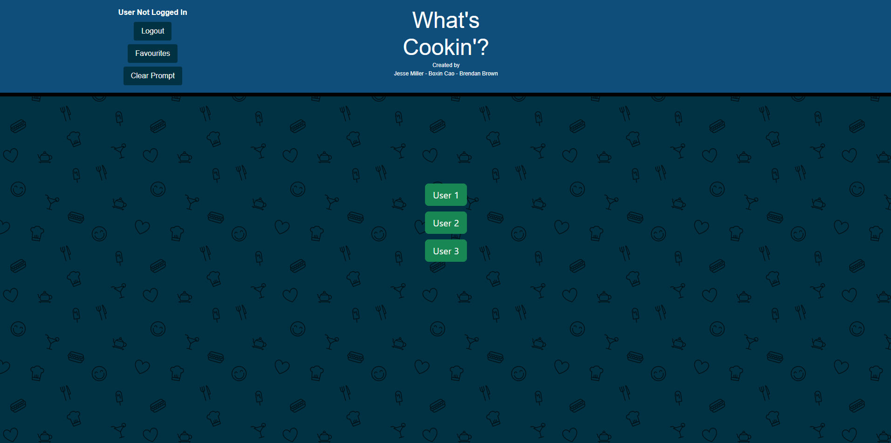
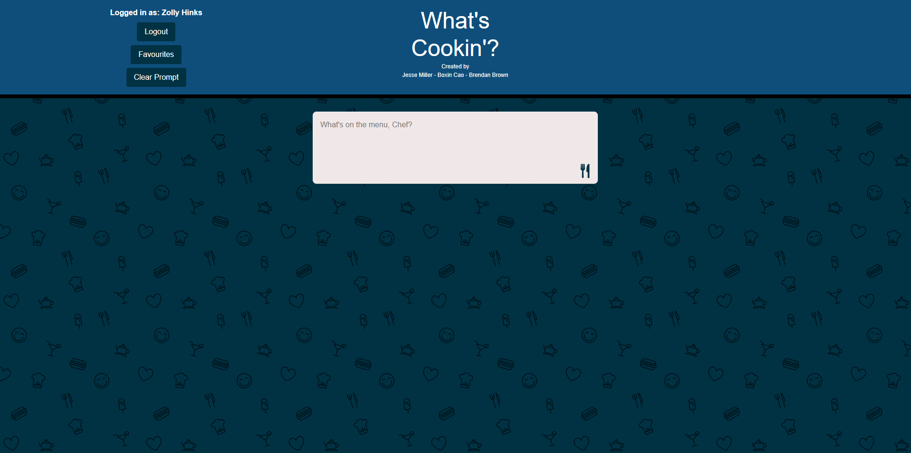
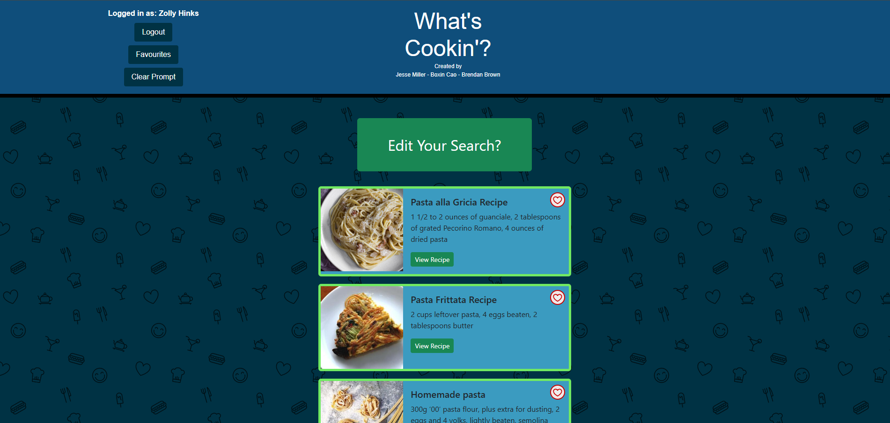
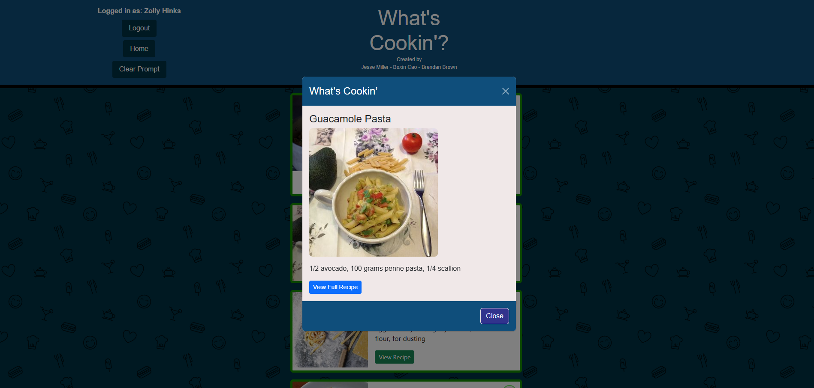

# What's Cookin'

A full-stack recipe application built with:

- **Client:**        React  
- **Server:**        Node.js + Express  
- **Database:**      PostgreSQL  
- **External APIs:** Recipe API, OpenAI API  

---

## Getting Started

### 1. Clone the repository

```bash
git clone git@github.com:wizbren/whats-cookin.git
cd whats-cookin
```

### 2. Install dependencies

#### 🔹 Client (React frontend)

```bash
cd client
npm install
```

#### 🔹 Server (Node backend)

```bash
cd server
npm install
```

### 3. Environment variables

```bash
cp .env.example .env
```

### 4. Set up the database

In your terminal, run:
```
createdb whatscookin
```

From the server/ directory run:
```
psql -d whatscookin -f src/db/schema.sql
```

This will:
- Create the Users and Recipes tables
- Set up foreign key constraints
- Enable cascading deletes on user removal

Seed the data using:
```
psql -d whatscookin -f src/db/seed.sql
```

### Make sure BOTH your client AND server directories have their own .env files that include the following:
```
CLIENT:

REACT_APP_OPENAI_API_KEY=your OpenAI API secret key
REACT_APP_EDAMAM_APP_ID=your Edamam API ID
REACT_APP_EDAMAM_APP_KEY=your Edamam API key

DB_NAME=whatscookin
DB_USER=<your_postgres_username>
DB_PASSWORD=<your_password>
DB_HOST=localhost
DB_PORT=5432

PORT=8080
```

```
SERVER:

REACT_APP_OPENAI_API_KEY=your OpenAI API secret key
EDAMAM_APP_ID=your Edamam API ID
EDAMAM_APP_KEY=your Edamam API key

DB_NAME=whatscookin
DB_USER=<your_postgres_username>
DB_PASSWORD=<your_password>
DB_HOST=localhost
DB_PORT=5432

PORT=8080
```

### 5. Run app

cd server
node index.js || npm start || npm run dev

cd client
npm start

### 6. Database Setup

createdb db
psql -d db -f server/src/db/schema.sql
psql -d db -f server/src/db/mockdata.sql


## Preview

### Login View



---

### 🍽️ Main View (Empty State)


---

### 🍲 Main View (With Recipes)


---

### Favourites Modal
